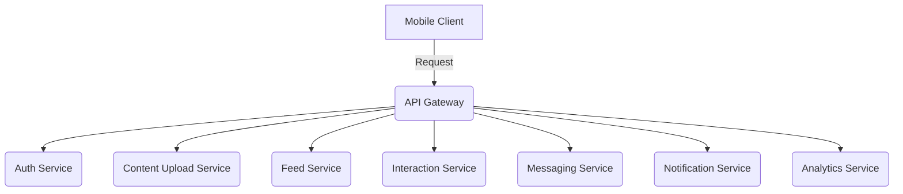

# Microservices Architecture สำหรับ MVP Instagram-like Mobile Application

## High-Level Architecture Diagram

## API Gateway
**Responsibilities:**
- Acts as the entry point for all clients, receiving requests and forwarding them to the relevant microservices.

**Features:**
- **Routing:**
- **Authentication & Authorization:**
- **Rate Limiting:**
- **Request/Response Transformation:** 

**Reasons:**
- Simplifies client interactions by providing a single interface for accessing the entire system.
- Centralizes security and traffic management.

## Auth Service
**Responsibilities:**
- Manages authentication and authorization.

**Reasons:**
- Separates security concerns from other services.
- Allows each service to focus on its business logic.

## Content Upload Service
**Responsibilities:**
- Handles image and video uploads.
- Resizes/reformats media files as necessary.

**Technologies:**
- Uses serverless functions (e.g., AWS Lambda) combined with storage services (e.g., AWS S3 or Firebase Storage).

**Reasons:**
- Reduces system load by offloading media management.
- Improves efficiency in handling and processing media files.

## Feed Service
**Responsibilities:**
- Generates personalized content feeds for users.

**Technologies:**
- Uses caching (e.g., Redis).
- Employs NoSQL databases for fast data retrieval.

**Reasons:**
- Ensures fast data access.
- Scales effectively with user demand.

## Interaction Service
**Responsibilities:**
- Manages user interactions such as likes and comments.
- Sends notifications to content owners.

**Technologies:**
- Uses a message broker (e.g., RabbitMQ or AWS SQS) to process requests asynchronously.

**Reasons:**
- Reduces latency in response times.
- Handles complex request processing efficiently.

## Messaging Service
**Responsibilities:**
- Provides real-time chat functionality between users.

**Technologies:**
- Uses WebSocket or an appropriate real-time communication protocol.

**Reasons:**
- Supports fast and responsive communication.
- Provides instant interaction for users.

## Notification Service
**Responsibilities:**
- Sends push notifications, SMS, or email alerts to users.

**Reasons:**
- Decouples notification management from core services.
- Allows scalable and efficient notification handling.

## Analytics Service
**Responsibilities:**
- Collects and analyzes user activity data, such as content views and engagement.

**Technologies:**
- Uses data pipelines (e.g., AWS Kinesis).
- Employs data warehouses (e.g., Redshift) for processing and reporting.

**Reasons:**
- Enables administrators to analyze user behavior.
- Helps improve the application based on data-driven insights.

# Pros, Cons, and Risks of This Architecture

## Pros
- **Modularity:** Services are separated by responsibility, allowing independent development and deployment.
- **Scalability:** Each service can scale independently based on demand.
- **Flexibility:** Different technologies can be chosen for each service.

## Cons
- **Complexity:** Managing a distributed system with multiple services can be challenging, particularly in inter-service communication and distributed logging.
- **Latency:** Communication between microservices may increase response times.

## Risks
- **Data Consistency:** Maintaining data consistency across distributed services can be challenging.
- **Deployment Complexity:** Deploying and managing multiple independent services requires sophisticated tools and processes.
