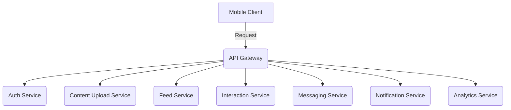

# Microservices Architecture สำหรับ MVP Instagram-like Mobile Application

## High-Level Architecture Diagram

## API Gateway
**หน้าที่:**
- ทำหน้าที่เป็น entry point สำหรับ client ทั้งหมด โดยรับ request จาก client แล้วส่งต่อไปยัง microservices ที่เกี่ยวข้อง

**ฟีเจอร์:**
- **Routing:**
- **Authentication & Authorization:**
- **Rate Limiting:**
- **Request/Response Transformation:** 

**เหตุผล:**
- ลดความซับซ้อนให้กับ client โดยให้มี interface เดียวสำหรับเข้าถึงระบบทั้งหมด
- Centralize การจัดการความปลอดภัยและการจัดการ traffic

## Auth Service
**หน้าที่:**
- จัดการ authentication และ authorization

**เหตุผล:**
- แยกการจัดกา security ออกจาก service อื่น ๆ
- ให้แต่ละ service โฟกัสที่ business logic ของตัวเองได้

## Content Upload Service
**หน้าที่:**
- รับผิดชอบการอัปโหลดรูปภาพและวิดีโอ
- ทำการ resize/reformat ไฟล์มีเดียตามความจำเป็น

**เทคโนโลยี:**
- ใช้ serverless functions (เช่น AWS Lambda) ร่วมกับบริการจัดเก็บไฟล์ (เช่น AWS S3 หรือ Firebase Storage)

**เหตุผล:**
- ลดภาระของระบบในการจัดการไฟล์มีเดีย
- เพิ่มประสิทธิภาพในการจัดการและประมวลผลไฟล์มีเดีย

## Feed Service
**หน้าที่:**
- จัดเตรียมเนื้อหา feed แบบ personalized ให้กับผู้ใช้งาน

**เทคโนโลยี:**
- ใช้ caching (เช่น Redis)
- ใช้ฐานข้อมูล NoSQL เพื่อรองรับการเข้าถึงข้อมูลที่รวดเร็ว

**เหตุผล:**
- รองรับการเข้าถึงข้อมูลที่รวดเร็ว
- ปรับขนาดได้ตามการใช้งานจริง

## Interaction Service
**หน้าที่:**
- จัดการการโต้ตอบของผู้ใช้งาน เช่น การกดไลค์และคอมเมนต์
- ส่งการแจ้งเตือนให้กับเจ้าของคอนเทนต์

**เทคโนโลยี:**
- ใช้ message broker (เช่น RabbitMQ หรือ AWS SQS) เพื่อประมวลผลคำขอแบบ asynchronous

**เหตุผล:**
- ลด latency ในการตอบสนอง
- รองรับการประมวลผลคำขอที่มีความซับซ้อน

## Messaging Service
**หน้าที่:**
- ให้บริการแชทแบบ real-time ระหว่างผู้ใช้งาน

**เทคโนโลยี:**
- ใช้ WebSocket หรือโปรโตคอลที่เหมาะสมสำหรับการสื่อสารแบบเรียลไทม์

**เหตุผล:**
- สนับสนุนการสื่อสารที่รวดเร็ว
- ตอบสนองต่อผู้ใช้งานในทันที

## Notification Service
**หน้าที่:**
- ส่ง push notifications, SMS หรืออีเมลแจ้งเตือนแก่ผู้ใช้งาน

**เหตุผล:**
- แยกการจัดการแจ้งเตือนออกจากบริการหลัก
- สามารถปรับขนาดและจัดการได้อย่างมีประสิทธิภาพ

## Analytics Service
**หน้าที่:**
- รวบรวมและวิเคราะห์ข้อมูลการใช้งาน เช่น การดูเนื้อหาและการมีส่วนร่วม

**เทคโนโลยี:**
- ใช้ data pipeline (เช่น AWS Kinesis)
- ใช้ data warehouse (เช่น Redshift) สำหรับการประมวลผลและสร้างรายงาน

**เหตุผล:**
- ช่วยให้ผู้ดูแลระบบวิเคราะห์พฤติกรรมของผู้ใช้
- ปรับปรุงแอปพลิเคชันในอนาคตจากข้อมูลที่วิเคราะห์ได้

# ข้อดี, ข้อเสีย และความเสี่ยงของสถาปัตยกรรมนี้

## ข้อดี (Pros)
- **Modularity:** แยกความรับผิดชอบของแต่ละ service ทำให้สามารถพัฒนาและ deploy แยกกันได้
- **Scalability:** แต่ละ service สามารถปรับขนาดได้ตามการใช้งานจริง
- **Flexibility:** สามารถเลือกใช้เทคโนโลยีที่เหมาะสมกับแต่ละ service

## ข้อเสีย (Cons)
- **ความซับซ้อน:** การบริหารจัดการระบบ distributed ที่มีหลาย service อาจซับซ้อนในเรื่องของ inter-service communication และ distributed logging
- **Latency:** การสื่อสารระหว่าง microservices อาจเพิ่มเวลาในการตอบสนอง

## ความเสี่ยง (Risks)
- **Data Consistency:** การรักษาความสอดคล้องของข้อมูลในระบบ distributed อาจเป็นความท้าทาย
- **Deployment Complexity:** การ deploy และจัดการหลาย service ที่แยกกันอาจต้องใช้เครื่องมือและกระบวนการที่ซับซ้อน
